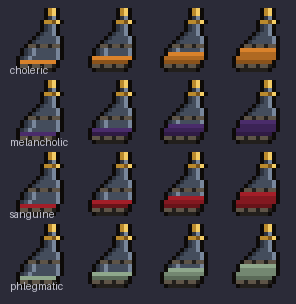

# Cinderflask

[](https://github.com/khillerb/cinderflask/actions/workflows/build.yml)

A Fabric 1.20.1 mod. Requires Fabric API.

> **2.0 is being built in the open and this README still describes 1.0 below.** The fuel mechanic is
> gone. The flask now holds a *brew* made of five essences — four humours that rotate as it ages, and
> a quintessence that decides how far it reaches — and you sip one dose at a time. The full rewrite of
> this file lands with the rest of the presentation work; until then the design lives in the plan, and
> `dev.cinderflask.brew` is the part that is real.

A flask that stores fuel and feeds a furnace one smelt at a time, so nothing is over-burned. Craft it
empty, then take a spark from a firefly, blaze or magma cube.



```
 G       G = Gold Ingot           Empty Cinderflask
G G      B = Glass Bottle              + right-click a Firefly, Blaze or Magma Cube
BBB      → Empty Cinderflask           = Cinderflask
```

## Why it saves fuel

A vanilla furnace burns a whole piece of fuel to light itself, so a lava bucket spent on one
cobblestone wastes 99 smelts.

The Cinderflask always reports a burn time of 200 ticks, one smelting operation, and hands itself
back to the fuel slot with 200 deducted. It is its own recipe remainder, so the furnace consumes it
and immediately puts it back.

Below 200 ticks it reports 0, so a spent flask can't light anything for free. It sits in the slot
until you refill it.

## Using it

- **Right-click** opens a one-slot intake. Anything you drop in is absorbed immediately.
- **Sneak + right-click** pulls every valid fuel out of your inventory at once.
- **Hover** shows smelts remaining; hold <kbd>Shift</kbd> for raw ticks.
- Works in furnaces, blast furnaces and smokers. Leave it in the fuel slot.

The texture shows the fill level across five states. The intake refuses anything that would hand back
a container (buckets, bottles) so you can't lose one to it.

## Configuring it

`config/cinderflask.json`:

```json
{
  "ticksPerOperation": 200,
  "maxEmbers": 10000000,
  "enableShiftFill": true,
  "consumeSparkSource": true
}
```

- `ticksPerOperation` — ticks spent per ignition. 200 is one vanilla smelt. Minimum 100.
- `maxEmbers` — capacity in ticks. The default is about 6,250 coal.
- `enableShiftFill` — turns off the sneak shortcut.
- `consumeSparkSource` — set `false` if sparking should spare the mob.

`ticksPerOperation` and `maxEmbers` are sent to clients on join so tooltips match the server. Changes
need a restart; the fuel registration is baked at load.

Two tags, both overridable by datapack:

- `#cinderflask:spark_source` (entity types) — what can spark an empty flask. Ships firefly
  (optional), blaze, magma cube. The tooltip and the EMI category read from this, so changing it
  needs no code.
- `#cinderflask:ember_deny` (items) — fuels the flask refuses. Ships lava bucket.

The recipe is an ordinary shaped recipe and can be replaced like any other.

## Known limits

Machines that consume fuel without honouring recipe remainders will destroy the flask rather than
hand it back. That affects several tech mods and can't be fixed from this side; the flask is for
vanilla furnaces.

Burn time is quantised to `ticksPerOperation`, so a smoker or blast furnace (100-tick cook) gets two
operations per charge rather than one.

## Building

```bash
./gradlew build
```

JDK 17. `check` depends on `runGametest`, so a green build means the furnace tests passed.

| | |
|---|---|
| `./gradlew runClient` | Dev client. |
| `./gradlew runDatagen` | Regenerates `src/main/generated`. |
| `python tools/gen_textures.py` | Regenerates the PNGs and `docs/preview.png`. |

The generated data and the PNGs are committed, and CI fails if they drift from what the generators
produce, so run the matching task after changing a recipe, tag, translation key or texture.

## Credits

A recreation of the **Fuel Canister** from
[Just Dire Things](https://github.com/Direwolf20-MC/JustDireThings) by Direwolf20, which is
Forge/NeoForge only. The idea is theirs; the code and art here are independent.

Named for [Prominence II: Hasturian Era](https://modrinth.com/modpack/prominence-2-fabric), but it
depends on nothing from that pack.

MIT. The `pt_br` and `es_es` translations were not written by native speakers — corrections welcome.
